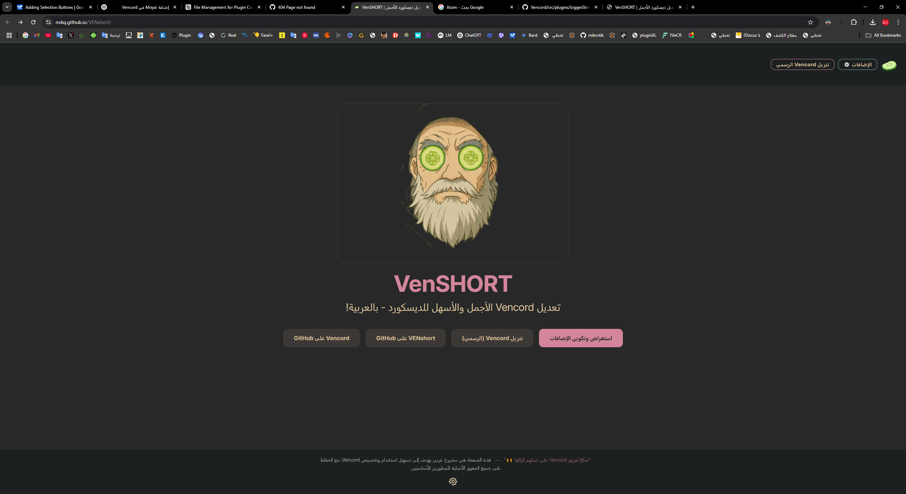

# ✨ VenSHORT | فينشورت ✨

  

<h2 align="center">تعديل Vencord الأجمل والأسهل للديسكورد - بالعربية!</h2>

  VenSHORT هو واجهة عربية محسّنة لمشروع Vencord الرائع، تهدف إلى جعل تجربة تخصيص Discord أسهل وأكثر متعة للمستخدمين العرب. يركز هذا المشروع بشكل خاص على تبسيط عملية اختيار وتكوين الإضافات.

  
   <em>الصفحة الرئيسية المعاد تصميمها</em>

---

## 🌟 الميزات الرئيسية

*   **🇸🇦 واجهة عربية بالكامل:** تم تعريب الواجهة الرئيسية وصفحة الإضافات لتوفير تجربة مستخدم سلسة باللغة العربية.
*   **⚙️ مولد تكوين الإضافات المحسّن (`fixed_plugins.html`):**
    *   **تصنيف واضح:** تم تقسيم الإضافات إلى فئات منطقية لتسهيل التصفح والاكتشاف.
    *   **تحديد سهل:** يمكنك تفعيل/تعطيل الإضافات بنقرة واحدة على بطاقة الإضافة نفسها.
    *   **تخصيص مباشر:** عدّل إعدادات بعض الإضافات الشائعة مباشرة من الواجهة دون الحاجة لتعديل JSON يدويًا.
    *   **إنشاء وتنزيل:** قم بإنشاء ملف `vencord_config.json` الخاص بك وانسخه أو نزّله بضغطة زر.
    *   **اقتراحات ذكية:** زر "تحديد المقترحة" يساعدك على البدء بمجموعة أساسية ومفيدة من الإضافات.
*   **🎨 تصميم متناسق وجذاب:** تم تنسيق الصفحات لتبدو جميلة وتتوافق مع ألوان ومظهر Vencord الأساسي.
*   **📱 متجاوب:** تصميم يراعي اختلاف أحجام الشاشات.

  
   <em>صفحة الإضافات المصنفة مع خيارات التكوين</em>

---

## 🚀 كيف أستخدمه؟

VenSHORT ليس تثبيتًا مستقلاً لـ Vencord، بل هو **أداة لتوليد ملف التكوين (`vencord_config.json`)** لواجهة عربية محسنة.

1.  **حمّل الملف:** قم بتنزيل ملف `fixed_plugins.html` من هذا المستودع.
2.  **افتحه في المتصفح:** افتح الملف الذي قمت بتنزيله باستخدام متصفح الويب الخاص بك (مثل Chrome, Firefox, Edge).
3.  **اختر إضافاتك:** تصفح الإضافات المصنفة. انقر على بطاقة الإضافة لتحديدها أو إلغاء تحديدها.
4.  **(اختياري) عدّل الإعدادات:** قم بتغيير الإعدادات المتاحة لبعض الإضافات مباشرة في الواجهة.
5.  **أنشئ التكوين:** انقر على زر "إنشاء التكوين".
6.  **انسخ أو نزّل:**
    *   انقر على "نسخ التكوين" لنسخ محتوى JSON.
    *   أو انقر على "تنزيل التكوين" لحفظ الملف باسم `vencord_config.json`.
7.  **طبّق التكوين:**
    *   ابحث عن مجلد إعدادات Vencord على جهازك.
    *   الصق محتوى JSON المنسوخ في ملف `vencord_config.json` الموجود، أو استبدل الملف الموجود بالملف الذي قمت بتنزيله.
8.  **أعد تشغيل Discord:** أغلق Discord تمامًا وأعد فتحه لتطبيق التغييرات. (يمكنك استخدام زر التنبيه في الأداة لتذكيرك).

---

## 🙏 شكر وتقدير (Credits)

هذا المشروع يعتمد بشكل كامل على **Vencord** الرائع ومجهودات فريقه ومساهميه. VenSHORT هو مجرد واجهة عربية مُحسّنة ومولّد تكوين.

*   **Vencord الموقع الرسمي:** [vencord.dev](https://vencord.dev/)
*   **Vencord GitHub:** [github.com/Vendicated/Vencord](https://github.com/Vendicated/Vencord)

نتوجه بخالص الشكر لفريق Vencord على هذا التعديل المدهش!

---

## 🤝 المساهمة

نرحب دائمًا بالمساهمات! إذا وجدت خطأ، أو لديك اقتراح لتحسين الترجمة أو إضافة ميزة:

1.  ابحث في قسم [Issues](https://github.com/nvkq/VENshort/issues) أولاً للتأكد من عدم وجود تقرير مماثل.
2.  إذا لم تجد، قم بفتح [Issue جديدة](https://github.com/nvkq/VENshort/issues/new).
3.  للتعديلات البرمجية، قم بعمل Fork للمستودع وأنشئ Pull Request.

---

## ⚠️ تنويه هام

استخدام تعديلات Discord (Mods) مثل Vencord قد يخالف شروط خدمة Discord وقد يؤدي (نظريًا) إلى تعليق الحساب. **استخدم VenSHORT و Vencord على مسؤوليتك الخاصة.** هذا المشروع مقدم "كما هو" بدون أي ضمانات.

---

**ملاحظات:**

*   تأكد من وضع لقطات الشاشة الفعلية في مجلد باسم `screenshots` (أو أي اسم تختاره) في جذر مشروعك وقم بتحديث المسارات في ملف README إذا لزم الأمر.
*   استبدل `YOUR_SITE_URL` في قسم `script type="application/ld+json"` برابط موقعك الفعلي إذا قمت بنشره.
*   يمكنك إضافة قسم للترخيص (License) إذا أردت.
*   تأكد من أن رابط مستودعك صحيح في قسم المساهمة (`https://github.com/nvkq/VENshort`).
